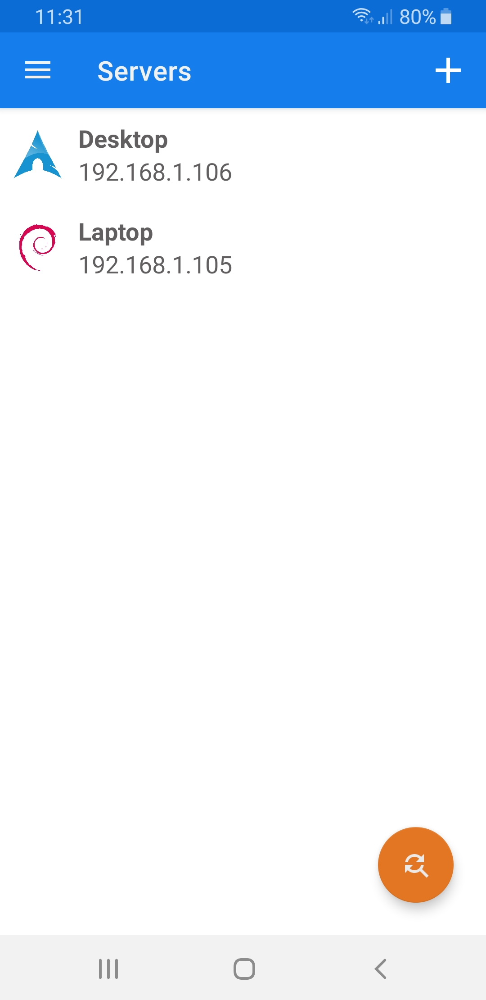
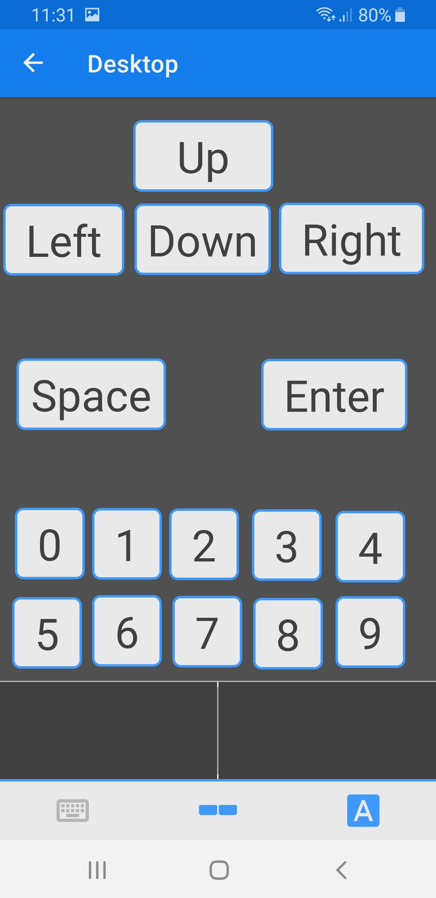
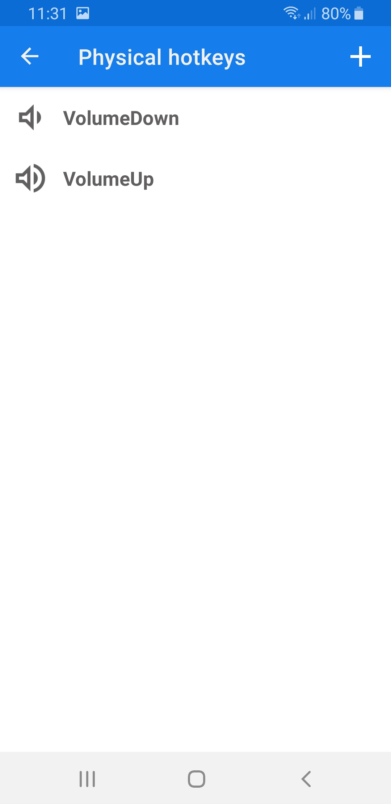

## Minimote Client

Client written in Kotlin for the [Minimote Server](https://github.com/Docheinstein/minimote-server)
that allows basic remote control (mouse and keyboard) of hosts.

Minimote Server has been implemented only for Linux by now.

The protocol supports a discover mechanism that allows the client to find active servers on the same network automatically.

In addition to the basic touchpad and keyboard functionalities, the application supports the mapping
of physical buttons (e.g. volume buttons) and the creation of custom layouts of software
buttons. Both physical and software buttons can be mapped to single keys (e.g. A, B, 0, Enter) or
hotkeys (e.g. Alt+Tab, Ctrl+C).

### Why

Mostly for control my laptop from my bed without standing up.

### Control functionalities

#### Mouse
* Movement
* Scroll
* Drag & Drop
* Left Click / Left Down / Left Up
* Right Click / Right Down / Right Up
* Middle Click / Middle Down / Middle Up

#### Keyboard
* Unicode typing
* Key Click / Key Down / Key Up
* Hotkey (e.g. Alt+F4, Ctrl+Alt+Canc, ...)

### What it looks like

