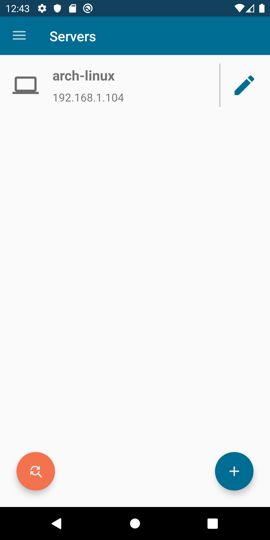
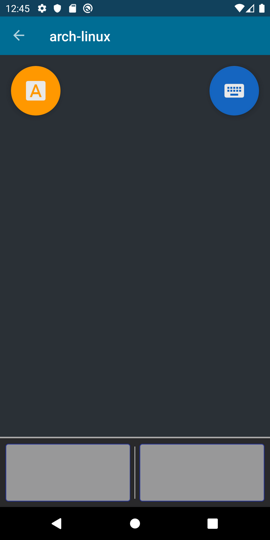
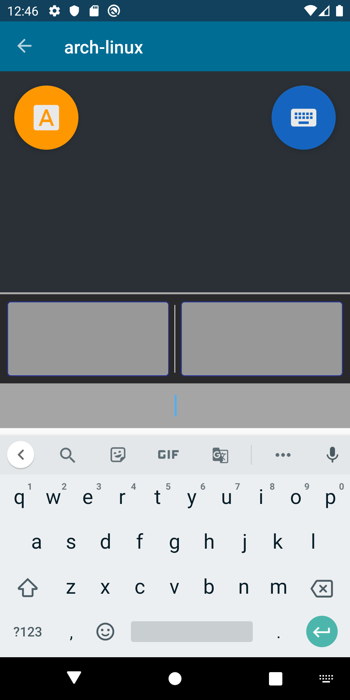
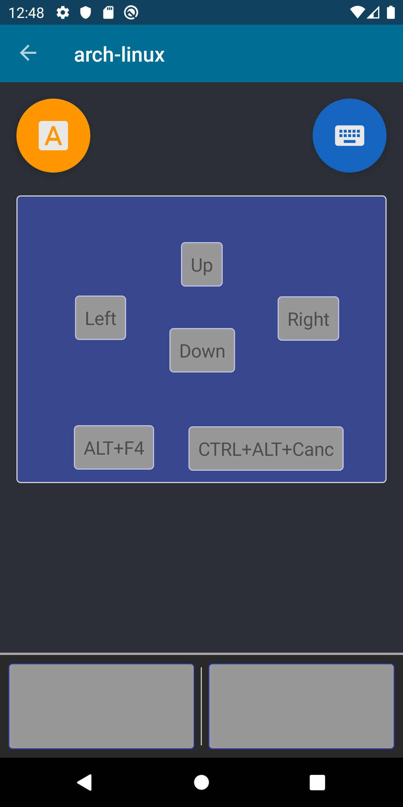

## Minimote Client

Client for the Minimote Server that allows remote control of Linux hosts.
Written in Java (Android).

### Why

So that I can use the Minimote Client for perform basic actions from my bed.

### Supported functionalities

1. Mouse movement
2. Unicode keys typing (limited to characters in the current keyboard layout)
3. Hotkeys (e.g. Alt+F4, Ctrl+Alt+Canc, ...)

### What it looks like

